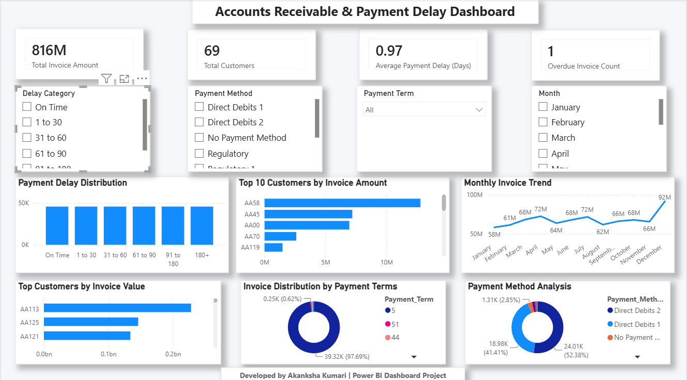

# Accounts Receivable & Payment Delay Dashboard

## Project Overview

This Power BI dashboard provides insights into accounts receivable performance, payment delays, customer behavior, and payment methods.

## Key Features

- Total Invoice Amount Analysis
- Average Payment Delay Tracking
- Overdue Invoice Monitoring
- Payment Delay Distribution Analysis
- Top Customers by Invoice Amount
- Monthly Invoice Trend Analysis
- Payment Method Analysis
- Interactive Slicers for Dynamic Filtering

## Tools Used

- Power BI Desktop
- DAX
- Data Modeling
- Data Visualization

## Dashboard Preview

## Key Insights

- Most invoices were paid On Time or within 30 days.
- Direct Debit methods contributed significantly to invoice payments.
- Customer AA58 generated the highest invoice amount.
- Invoice trends varied across months with peak activity in December.

## Author

**Akanksha Kumari**
MBA (Data Analytics) | Aspiring Data Analyst
